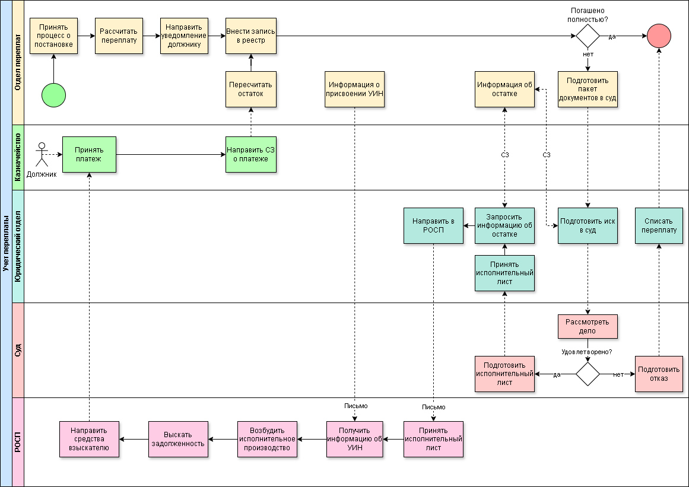

# Документация проекта "Система учета переплат"
## Состав репозитория
* /diagrams/ - модели данных (AS IS, TO BE и ER-диаграммы)
* /technical-specs/ - техническое задание и требования к продукту
* /manual/ - руководство пользователя

Проект разработан для унификации работы отделов различных управлений по учету и работе с переплатами и автоматизации контрольных фуункций с целью повысить процент погашений задолженностей.

На начальном этапе был проведен анализ бизнеса-процесса по работе с переплатами, в ходе которого было выявлены узкие места, простои, отсутствие контрольных точек ().  
